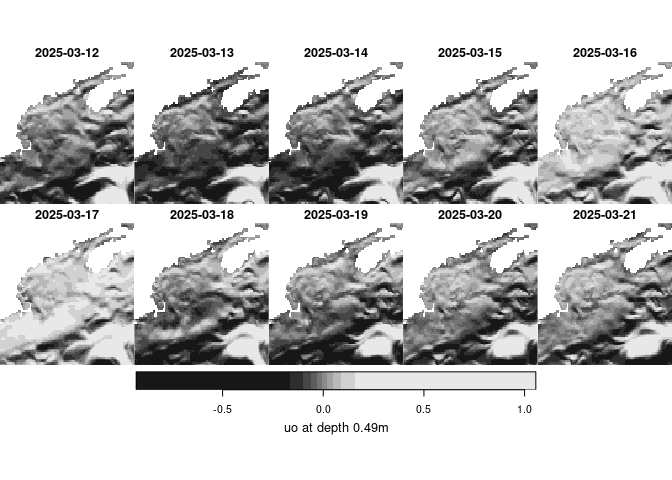

copernicus
================

Provides access, download and archiving tools for
[Copernicus](https://marine.copernicus.eu/) marine datasets using R
language. This package has been developed primarily around the [daily
ocean physics
forecast](https://data.marine.copernicus.eu/product/GLOBAL_ANALYSISFORECAST_PHY_001_024/download?dataset=cmems_mod_glo_phy_anfc_0.083deg_P1D-m)
but with no or minimal modification it can work with other products.

### Note

In 2023/2024 Copernicus migrated to a new service model. Learn more
[here](Migrating%20to%20the%20new%20Global%20Physical%20Analysis%20and%20Forecasting%20System).
This migration introduced the [Copernicus Marine
Toolbox](https://help.marine.copernicus.eu/en/collections/4060068-copernicus-marine-toolbox)
which provides a Python API and a command line interface (CLI). This
package leverages the latter.

## Copernicus resources

Copernicus serves **so many** data resources; finding what you want can
be a challenge. Check out the new [Marine Data
Store](https://marine.copernicus.eu/news/introducing-new-copernicus-marine-data-store).
And checkout the listing
[here](https://marine.copernicus.eu/about/producers).

### The all important datasetID

Like data offerings from [OBPG](https://oceancolor.gsfc.nasa.gov/),
Copernicus strives to provided consistent dataset identifiers that are
easily decoded programmatically (and with practice by eye). In order to
download programmatically you must have the datasetID in hand. Learn
more about Copernicus [nomenclature rules
here](https://help.marine.copernicus.eu/en/articles/6820094-how-is-defined-the-nomenclature-of-copernicus-marine-data#h_34a5a6f21d).

### `get` or `subset`

The [Copernicus Marine
Toolbox](https://help.marine.copernicus.eu/en/collections/4060068-copernicus-marine-toolbox)
command-line application, `copernicus-marine` provides two primary
methods for donwloading data: `get` and `subset`. `get` is not well
documented, but subset does what it implies - subsetting resources by
variable, spatial bounding box and time. This package only supports
`subset`.

## Requirements

- [R v4+](https://www.r-project.org/)
- [rlang](https://CRAN.R-project.org/package=rlang)
- [dplyr](https://CRAN.R-project.org/package=dplyr)
- [ncdf4](https://CRAN.R-project.org/package=ncdf4)
- [sf](https://CRAN.R-project.org/package=sf)
- [stars](https://CRAN.R-project.org/package=stars)
- [readr](https://CRAN.R-project.org/package=readr)
- [twinkle](https://github.com/BigelowLab/twinkle)

## Installation

    remotes::install_github("BigelowLab/copernicus")

## Configuration

You can preconfigure a credentials file (required) and a path definition
file (optional) to streamline accessing and storing data.

### Configure credentials

You must have credentials to access Copernicus holdings - if you don’t
have them now please request access
[here](https://data.marine.copernicus.eu/register).

Once you have them you can add them to a file hidden in your home
directory. The functions in this package that require the credentials
know where to look for them. We don’t actually run this in the README,
but you can copy-and-paste to use in R; obviously you will insert your
own username and password.

    library(copernicus)
    set_credentials("username:password")

### Configure data path

If you plan to use our directory-driven database storage system then you
should set the root path for the data directory. You can always change
or override it, but, like credentials, storing this path in a hidden
file will ease subsequent use of the functions. We don’t actually run
this in the README, but you can copy-and-paste to use in R. Again,
replace the path with one suiting your own situation.

    set_root_path("/the/path/to/copernicus/data")

## Fetching data

To fetch data we’ll focus on [ocean physics daily
forecast](https://data.marine.copernicus.eu/product/GLOBAL_ANALYSISFORECAST_PHY_001_024/download?dataset=cmems_mod_glo_phy-cur_anfc_0.083deg_P1D-m)
which serves daily mean sea surface currents. We’ll define a date range
and the bounding box that covers the Gulf of Maine (gom).

``` r
suppressPackageStartupMessages({
  library(stars)
  library(copernicus)
  library(dplyr)
})
dataset_id = "cmems_mod_glo_phy-cur_anfc_0.083deg_P1D-m"    
vars = c("uo","vo")
bb = c(xmin = -72, xmax = -63, ymin = 39, ymax = 46)
depth = c(0,1) # just the top 10 meters
time = (c(0, 9) + Sys.Date())  # today - and a little ahead window
x = fetch_copernicus(dataset_id = dataset_id, 
                     vars = vars, 
                     bb = bb, 
                     time = time,
                     cleanup = FALSE,
                     verbose = TRUE)
```

    ## copernicus-marine subset -i cmems_mod_glo_phy-cur_anfc_0.083deg_P1D-m --log-level QUIET -v uo -v vo -x -72.00 -X -63.00 -y 39.00 -Y 46.00 -z 0.00 -Z 10.00 -t "2023-12-20" -T "2023-12-29" --force-download --overwrite -f output.nc -o .

``` r
x
```

    ## stars object with 4 dimensions and 2 attributes
    ## attribute(s):
    ##           Min.     1st Qu.       Median         Mean    3rd Qu.     Max.   NA's
    ## uo  -0.7963526 -0.08457322 -0.003029692 3.098703e-02 0.07812081 1.509007 216380
    ## vo  -1.4806886 -0.08874905 -0.020613649 3.607781e-05 0.04513337 1.390010 216380
    ## dimension(s):
    ##       from  to         offset    delta  refsys
    ## x        1 109         -72.04  0.08333  WGS 84
    ## y        1  85          46.04 -0.08333  WGS 84
    ## depth    1   8             NA       NA      NA
    ## time     1  10 2023-12-20 UTC   1 days POSIXct
    ##                                            values x/y
    ## x                                            NULL [x]
    ## y                                            NULL [y]
    ## depth [0.494025,1.541375),...,[9.572997,11.21643)    
    ## time                                         NULL

We can plot a subset of these using base graphics and the `[` function.
`stars` objects are indexed first by the attribute (variable) followed
by the dimensions. In this case the index order is \[`attribute`, `x`,
`y`, `depth`, `time`\] or \[`attribute`, `x`, `y`, `time`\] for
single-depth objects.

``` r
itime = 1
date = format(st_get_dimension_values(x, "time")[itime], "%Y-%m-%d")
plot(x[1, , , , itime], key.lab = paste("uo for each depth on", date))
```

<!-- -->

If you want to plot all of the times for a given depth you can use
`slice`.

``` r
idepth = 1
depth = round(st_get_dimension_values(x, 'depth')[idepth],2)
plot(slice(x, "depth", idepth), 
     key.lab = paste0("uo at depth ", depth, "m"))
```

<!-- -->

## Archiving data

You can download and archive data using the database functionality
provided in this package. There are a number of ways to manage suites of
data, this is just one fairly light weight method.

Here, we store data in a directory tree that starts with `region` at
it’s root. Within the `region` we divide by `year`, `monthday`. Within
in each `monthday` directory there are one or more files uniquely named
to provide complete identification of datasetid, time, depth, period,
variable and treatment. Each file contains one raster for one variable
at one depth and one time.

Here is an example of a file name that follows this pattern.

`datasetid__time_depth_period_variable_treatment.tif`

    gom/2023/1205/cmems_mod_glo_phy-cur_anfc_0.083deg_P1D-m__2023-12-05T000000_0.49_day_uo_raw.tif

Here you can see that datasetid and the rest of the identifiers are
separated by a double underscore to aid in programmatic parsing. Time
includes the hour in case we ever want to download the 6-hour datasets.
The depth is rounded to three significant digits by default, but that is
configurable. The treatment, `raw`, in this case means the values are as
downloaded, however, if you ever wanted to roll your own running mean
(say 8-day rolling mean) or some other statistic this naming system
provides the flexibility you will need.

**NOTE** Don’t forget to [set your root data
path](#Configure-data-path).

First we define an output path for the Gulf of Maine data. The path
isn’t created until data is written to it. Then we simply call
`archive_copernicus()` to automatically write individual GeoTIFF files
into a database structure. Note that we provide an identifier that
provides the provenance of the data. We receive, in turn, a table that
serves as a database.

``` r
path = copernicus_path("gom")
db = archive_copernicus(x, path = path, id = 'cmems_mod_glo_phy-cur_anfc_0.083deg_P1D-m') |>
  dplyr::glimpse()
```

    ## Rows: 160
    ## Columns: 7
    ## $ id        <chr> "cmems_mod_glo_phy-cur_anfc_0.083deg_P1D-m", "cmems_mod_glo_…
    ## $ date      <date> 2023-12-20, 2023-12-20, 2023-12-21, 2023-12-21, 2023-12-22,…
    ## $ time      <chr> "000000", "000000", "000000", "000000", "000000", "000000", …
    ## $ depth     <chr> "0.494", "0.494", "0.494", "0.494", "0.494", "0.494", "0.494…
    ## $ period    <chr> "day", "day", "day", "day", "day", "day", "day", "day", "day…
    ## $ variable  <chr> "uo", "vo", "uo", "vo", "uo", "vo", "uo", "vo", "uo", "vo", …
    ## $ treatment <chr> "raw", "raw", "raw", "raw", "raw", "raw", "raw", "raw", "raw…

Since this is the first time you uhave downloaded and archived data, be
sure to save the database.

``` r
write_database(db, path)
```

### Using the database

The database is very lightand easy to filter for just the records you
might need. Note that depth is a character data type; this provides you
with flexibility to define depth as ‘surface’ or ‘50-75’ or something
like that.

Let’s walk through reading the database, filtering it for a subset,
reading the files and finally displaying.

``` r
db <- copernicus::read_database(path) |>
  dplyr::filter(dplyr::between(date, Sys.Date(), Sys.Date()+1)) |>
  dplyr::glimpse()
```

    ## Rows: 32
    ## Columns: 7
    ## $ id        <chr> "cmems_mod_glo_phy-cur_anfc_0.083deg_P1D-m", "cmems_mod_glo_…
    ## $ date      <date> 2023-12-20, 2023-12-20, 2023-12-21, 2023-12-21, 2023-12-20,…
    ## $ time      <chr> "000000", "000000", "000000", "000000", "000000", "000000", …
    ## $ depth     <chr> "0.494", "0.494", "0.494", "0.494", "1.541", "1.541", "1.541…
    ## $ period    <chr> "day", "day", "day", "day", "day", "day", "day", "day", "day…
    ## $ variable  <chr> "uo", "vo", "uo", "vo", "uo", "vo", "uo", "vo", "uo", "vo", …
    ## $ treatment <chr> "raw", "raw", "raw", "raw", "raw", "raw", "raw", "raw", "raw…

Now we can read in the files.

``` r
s = read_copernicus(db, path)
s
```

    ## stars object with 4 dimensions and 2 attributes
    ## attribute(s):
    ##           Min.    1st Qu.      Median        Mean     3rd Qu.     Max.  NA's
    ## uo  -0.5541596 -0.1364145 -0.04991820 -0.01058245 0.028018354 1.430314 43276
    ## vo  -0.9301572 -0.1236051 -0.06047948 -0.04066983 0.003148441 1.390010 43276
    ## dimension(s):
    ##       from  to         offset    delta  refsys point
    ## x        1 109         -72.04  0.08333  WGS 84 FALSE
    ## y        1  85          46.04 -0.08333  WGS 84 FALSE
    ## depth    1   8             NA       NA      NA    NA
    ## time     1   2 2023-12-20 UTC   1 days POSIXct    NA
    ##                                 values x/y
    ## x                                 NULL [x]
    ## y                                 NULL [y]
    ## depth [0.494,1.541),...,[9.573,11.216)    
    ## time                              NULL
