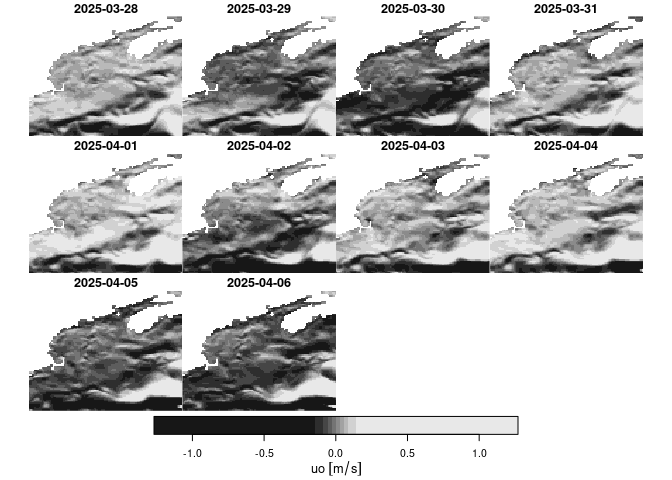

copernicus
================

Provides access to, and download from, [Copernicus Marine Data
Store](https://marine.copernicus.eu/) using R language. This package has
been developed primarily around …

- [GLOBAL_MULTIYEAR_PHY_001_030](https://data.marine.copernicus.eu/product/GLOBAL_MULTIYEAR_PHY_001_030/description)
  31 Dec 1992 to a month or more lag

- [GLOBAL_ANALYSISFORECAST_PHY_001_024](https://data.marine.copernicus.eu/product/GLOBAL_ANALYSISFORECAST_PHY_001_024/description)
  31 Oct 2020 to 9 days from present (forecast)

With no or minimal modification it can work with other products.

### Note

In 2023/2024 Copernicus migrated to a new service model; learn more
[here](https://help.marine.copernicus.eu/en/articles/7045314-migrating-to-the-new-global-physical-analysis-and-forecasting-system).
This migration introduced the [Copernicus Marine
Toolbox](https://help.marine.copernicus.eu/en/collections/4060068-copernicus-marine-toolbox)
which provides a Python API and a command line interface (CLI). This
package leverages the latter.

The toolbox is under active development, so if you are having troubles
(like we have sometimes!) try re-installing. We have some notes
[here](https://github.com/BigelowLab/copernicus/wiki/Installation-of-%60copernicusmarine%60).

# Copernicus resources

Copernicus serves **so many** data resources; finding what you want can
be a challenge. Check out the new [Marine Data
Store](https://marine.copernicus.eu/news/introducing-new-copernicus-marine-data-store).
And checkout the listing
[here](https://marine.copernicus.eu/about/producers).

## Data catalogs

Like data offerings from [OBPG](https://oceancolor.gsfc.nasa.gov/),
Copernicus strives to provided consistent dataset identifiers that are
easily decoded programmatically (and with practice by eye). In order to
download programmatically you must have the datasetID in hand. Learn
more about Copernicus [nomenclature rules
here](https://help.marine.copernicus.eu/en/articles/6820094-how-is-defined-the-nomenclature-of-copernicus-marine-data#h_34a5a6f21d).
We leverage the [data catalogs](#data-catalogs) which link a **product**
to one or more of its **datasets**. Did you catch that? Copernicus
distributes **products** each of which comes as one or more
**datasets**. There’s mor eon that later.

## `get` or `subset`

The [Copernicus Marine
Toolbox](https://help.marine.copernicus.eu/en/collections/4060068-copernicus-marine-toolbox)
command-line application, `copernicus-marine` provides two primary
methods for donwloading data: `get` and `subset`. `get` is not well
documented, but subset does what it implies - subsetting resources by
variable, spatial bounding box, depth and time. This package only
supports `subset`.

## Requirements

- [R v4.1+](https://www.r-project.org/)
- [rlang](https://CRAN.R-project.org/package=rlang)
- [dplyr](https://CRAN.R-project.org/package=dplyr)
- [ncdf4](https://CRAN.R-project.org/package=ncdf4)
- [sf](https://CRAN.R-project.org/package=sf)
- [stars](https://CRAN.R-project.org/package=stars)
- [readr](https://CRAN.R-project.org/package=readr)

## Installation

    remotes::install_github("BigelowLab/copernicus")

## Configuration

You can preconfigure a credentials file (required) and a path definition
file (optional) to streamline accessing and storing data.

### Configure credentials

You must have credentials to access Copernicus holdings - if you don’t
have them now please request access
[here](https://data.marine.copernicus.eu/register). Go straight to it
[here](https://help.marine.copernicus.eu/en/articles/8185007-copernicus-marine-toolbox-credentials-configuration).

### Configure data path

If you plan to use our directory-driven database storage system then you
should set the root path for the data directory; keep in mind that you
can always change or override it. We don’t actually run this in the
README, but you can copy-and-paste to use in R. Again, replace the path
with one suiting your own situation.

    copernicus::set_root_path("/the/path/to/copernicus/data")

Once it is set, you shouldn’t have to set it again (unless you want to
change the path).

#### Configure the application path

If you are using R within a RStudio session, you may encounter issues
where `system()` and `system2()` can’t’ find the `copernicusmarine`
application. This is not the case when you run R outside of the RStudio
context. Technically, this is a environmental path issue, which you can
remedy by providing the full path specification for the `app` argument
to the function `build_cli_subset()`. By default,
`app = 'copernicusmarine`, but you may need to include the full path
specification. We provide a mechanism for storing this path in a
configuration file once, and then it will work without issue in
subsequent sessions of R. Here’s how we set ours.

First determine the app path in the terminal session (outside of RStudio
context).

    $ which copernicusmarine
    /opt/copernicus/bin/copernicusmarine

Then set the path.

``` r
copernicus::set_copernicus_app("/opt/copernicus/bin/copernicusmarine")
```

This is optional (but worth it if you operate within RStudio). You can
retrieve the application path with `get_copernicus_app()`, which
defaults to `copernicusmarine` if you didn’t set the path.

``` r
copernicus::get_copernicus_app()
```

    ## [1] "/opt/copernicus/bin/copernicusmarine"

## Product catalog

You can download a product catalog for local storage.

``` r
suppressPackageStartupMessages({
  library(copernicus)
  library(stars)
})

ok = copernicus::fetch_product_catalog(product_id = "GLOBAL_ANALYSISFORECAST_BGC_001_028")
```

This downloads into a “catalogs” directory within your data directory
Now read it in.

``` r
x = copernicus::read_product_catalog(product_id = "GLOBAL_ANALYSISFORECAST_BGC_001_028")
x
```

    ## # A tibble: 31 × 7
    ##    product_id       title dataset_id dataset_name short_name standard_name units
    ##    <chr>            <chr> <chr>      <chr>        <chr>      <chr>         <chr>
    ##  1 GLOBAL_ANALYSIS… Glob… cmems_mod… daily mean … nppv       net_primary_… mg m…
    ##  2 GLOBAL_ANALYSIS… Glob… cmems_mod… daily mean … o2         mole_concent… mmol…
    ##  3 GLOBAL_ANALYSIS… Glob… cmems_mod… Monthly mea… nppv       net_primary_… mg m…
    ##  4 GLOBAL_ANALYSIS… Glob… cmems_mod… Monthly mea… o2         mole_concent… mmol…
    ##  5 GLOBAL_ANALYSIS… Glob… cmems_mod… daily mean … dissic     mole_concent… mol …
    ##  6 GLOBAL_ANALYSIS… Glob… cmems_mod… daily mean … ph         sea_water_ph… 1    
    ##  7 GLOBAL_ANALYSIS… Glob… cmems_mod… daily mean … talk       sea_water_al… mol …
    ##  8 GLOBAL_ANALYSIS… Glob… cmems_mod… Monthly mea… dissic     mole_concent… mol …
    ##  9 GLOBAL_ANALYSIS… Glob… cmems_mod… Monthly mea… ph         sea_water_ph… 1    
    ## 10 GLOBAL_ANALYSIS… Glob… cmems_mod… Monthly mea… talk       sea_water_al… mol …
    ## # ℹ 21 more rows

By default this provides a flattened table of available datasets along
with tables of variables for each (if any). Here’s the first dataset (a
constituent of product suite)

``` r
dplyr::filter(x, dataset_id %in% "cmems_mod_glo_bgc-bio_anfc_0.25deg_P1D-m") |>
  dplyr::glimpse()
```

    ## Rows: 2
    ## Columns: 7
    ## $ product_id    <chr> "GLOBAL_ANALYSISFORECAST_BGC_001_028", "GLOBAL_ANALYSISF…
    ## $ title         <chr> "Global Ocean Biogeochemistry Analysis and Forecast", "G…
    ## $ dataset_id    <chr> "cmems_mod_glo_bgc-bio_anfc_0.25deg_P1D-m", "cmems_mod_g…
    ## $ dataset_name  <chr> "daily mean fields from Global Ocean Biogeochemistry Ana…
    ## $ short_name    <chr> "nppv", "o2"
    ## $ standard_name <chr> "net_primary_production_of_biomass_expressed_as_carbon_p…
    ## $ units         <chr> "mg m-3 day-1", "mmol m-3"

## Which products? Which datasets?

[CMEMS](https://data.marine.copernicus.eu/products) offers many
products - which ones have we set up for this package? (Note, it’s
subject to change).

[GLOBAL_MULTIYEAR_PHY_001_030](https://data.marine.copernicus.eu/product/GLOBAL_MULTIYEAR_PHY_001_030/description)
31 Dec 1992 to a month or more lag

[GLOBAL_ANALYSISFORECAST_PHY_001_024](https://data.marine.copernicus.eu/product/GLOBAL_ANALYSISFORECAST_PHY_001_024/description)
31 Oct 2020 to 9 days from present (forecast)

[GLOBAL_ANALYSISFORECAST_BGC_001_028](https://data.marine.copernicus.eu/product/GLOBAL_ANALYSISFORECAST_BGC_001_028/description)
2021-10-01 to 9 days from present

## Fetching data

To fetch data we’ll focus on [ocean physics daily
forecast](https://data.marine.copernicus.eu/product/GLOBAL_ANALYSISFORECAST_PHY_001_024/download?dataset=cmems_mod_glo_phy-cur_anfc_0.083deg_P1D-m)
which serves daily mean sea surface currents. We’ll define a date range
and the bounding box that covers the Gulf of Maine (gom), and we’ll
confine the request to just the surface data.

``` r
suppressPackageStartupMessages({
  library(stars)
  library(copernicus)
  library(dplyr)
})
product_id = "GLOBAL_ANALYSISFORECAST_PHY_001_024"
dataset_id = "cmems_mod_glo_phy-cur_anfc_0.083deg_P1D-m"    
vars = c("uo","vo")
bb = c(xmin = -72, xmax = -63, ymin = 39, ymax = 46)
path = copernicus_path(product_id, "gom") |>
  make_path()
depth = c(0,1) # just the top 1 meter
time = c(0, 9) + Sys.Date()  # today - and a little ahead window
ofile = copernicus_path("tmp", 
                        paste0(product_id, "__", dataset_id, ".nc"))
ok = download_copernicus_cli_subset(dataset_id = dataset_id, 
                                   vars = vars, 
                                   depth = depth,
                                   bb = bb, 
                                   time = time, 
                                   ofile = ofile)
x = stars::read_stars(ofile)
```

    ## uo, vo,

``` r
x
```

    ## stars object with 4 dimensions and 2 attributes
    ## attribute(s):
    ##                Min.     1st Qu.      Median        Mean    3rd Qu.     Max.
    ## uo [m/s] -0.9230007 -0.08498658 -0.01408345  0.01123039 0.04875003 1.479645
    ## vo [m/s] -1.8433951 -0.06975559 -0.01406787 -0.02037171 0.03712043 1.345416
    ##           NA's
    ## uo [m/s] 26800
    ## vo [m/s] 26800
    ## dimension(s):
    ##       from  to         offset    delta  refsys x/y
    ## x        1 109         -72.04  0.08333      NA [x]
    ## y        1  85          46.04 -0.08333      NA [y]
    ## depth    1   1      0.494 [m]       NA      NA    
    ## time     1  10 2025-05-12 UTC   1 days POSIXct

``` r
plot(x['uo'], axes = TRUE)
```

<!-- -->
