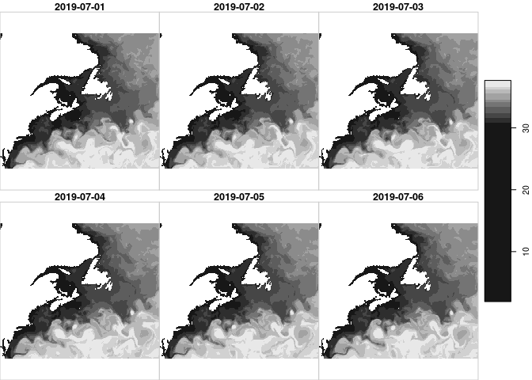
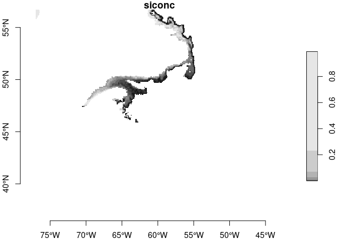
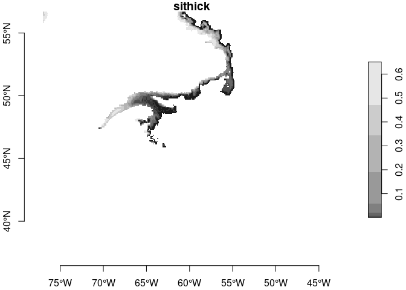

copernicus
================

# copernicus

Provides download, archiving and access to
[Copernicus](https://marine.copernicus.eu/) marine local datasets.

### Requirements

  - [R v4+](https://www.r-project.org/)
  - [rlang](https://CRAN.R-project.org/package=rlang)
  - [dplyr](https://CRAN.R-project.org/package=dplyr)
  - [ncdf4](https://CRAN.R-project.org/package=ncdf4)
  - [sf](https://CRAN.R-project.org/package=sf)
  - [stars](https://CRAN.R-project.org/package=stars)
  - [readr](https://CRAN.R-project.org/package=readr)
  - [twinkle](https://github.com/BigelowLab/twinkle)

### Installation

    remotes::install_github("BigelowLab/copernicus")

## Downloading

You don’t need to download data unless you need to download areas
outside of `nwa` `[-77.0, -42.5, 36.5, 56.7]` See the
[wiki](https://github.com/BigelowLab/copernicus/wiki/Downloading) for
hints.

## Local dataset

We maintain a local dataset for the Northwest Atlantic (`nwa` `[-77.0,
-42.5, 36.5, 56.7]`). In particular we have the
[GLOBAL\_ANALYSIS\_FORECAST\_PHY\_001\_024](https://resources.marine.copernicus.eu/?option=com_csw&view=details&product_id=GLOBAL_ANALYSIS_FORECAST_PHY_001_024)
for 10 surface water variables and bottom temp going back to January 1,
2019.

### Path

``` r
library(dplyr)
library(stars)
library(copernicus)
dataset <- "global-analysis-forecast-phy-001-024"
path <- copernicus::copernicus_path(dataset, "nwa")
```

### Database

The database is very light, just date variable and depth. Depth recorded
this way will allow for intermediate depths and depths ranges (‘50’ or
‘50-100’).

``` r
db <- copernicus::read_database(path)
db
```

    ## # A tibble: 8,921 x 3
    ##    date       var     depth
    ##    <date>     <chr>   <chr>
    ##  1 2019-01-01 mlotst  sur  
    ##  2 2019-01-01 siconc  sur  
    ##  3 2019-01-01 thetao  sur  
    ##  4 2019-01-01 usi     sur  
    ##  5 2019-01-01 sithick sur  
    ##  6 2019-01-01 bottomT bot  
    ##  7 2019-01-01 vsi     sur  
    ##  8 2019-01-01 vo      sur  
    ##  9 2019-01-01 uo      sur  
    ## 10 2019-01-01 so      sur  
    ## # … with 8,911 more rows

### Look Up Table (lut)

The variable names are a bit cryptic (at least to me) so we provide a
look-up table that associates the variable name with other information
available from the source.

``` r
lut <- copernicus::read_lut(name = dataset)
print(lut, n = nrow(lut))
```

    ## # A tibble: 11 x 3
    ##    name    longname                            units    
    ##    <chr>   <chr>                               <chr>    
    ##  1 mlotst  Density ocean mixed layer thickness m        
    ##  2 siconc  Ice concentration                   1        
    ##  3 thetao  Temperature                         degrees_C
    ##  4 usi     Sea ice eastward velocity           m s-1    
    ##  5 sithick Sea ice thickness                   m        
    ##  6 bottomT Sea floor potential temperature     degrees_C
    ##  7 vsi     Sea ice northward velocity          m s-1    
    ##  8 vo      Northward velocity                  m s-1    
    ##  9 uo      Eastward velocity                   m s-1    
    ## 10 so      Salinity                            1e-3     
    ## 11 zos     Sea surface height                  m

### Filenames

Filenames can be made with the database and the path.

``` r
small_db <- db %>%
  dplyr::filter(var == 'so' & between(date, as.Date("2019-07-01"), as.Date("2019-07-06")))
filenames <- copernicus::compose_filename(small_db, path)
filenames
```

    ## [1] "/mnt/ecocast/coredata/copernicus/global-analysis-forecast-phy-001-024/nwa/2019/0701/2019-07-01_so_sur.tif"
    ## [2] "/mnt/ecocast/coredata/copernicus/global-analysis-forecast-phy-001-024/nwa/2019/0702/2019-07-02_so_sur.tif"
    ## [3] "/mnt/ecocast/coredata/copernicus/global-analysis-forecast-phy-001-024/nwa/2019/0703/2019-07-03_so_sur.tif"
    ## [4] "/mnt/ecocast/coredata/copernicus/global-analysis-forecast-phy-001-024/nwa/2019/0704/2019-07-04_so_sur.tif"
    ## [5] "/mnt/ecocast/coredata/copernicus/global-analysis-forecast-phy-001-024/nwa/2019/0705/2019-07-05_so_sur.tif"
    ## [6] "/mnt/ecocast/coredata/copernicus/global-analysis-forecast-phy-001-024/nwa/2019/0706/2019-07-06_so_sur.tif"

### Read timeseries of one variable

The [stars](https://r-spatial.github.io/stars/) package provides nice
input utilities. We have selected above just one variable for 6 days.
So, it would be nice to have just one attribute with 6 bands.

``` r
x <- stars::read_stars(filenames, along = 'time') %>%
  stars::st_set_dimensions(which = 'time', value = small_db$date)
plot(x)
```

<!-- -->

### Read a day of multiple variables

Let select another subset of multiple variables for just one day (we
could do multiple variables for multiple days, but, really, this is just
a demo.) In this case we want multiple attributes (variables).
[stars](https://r-spatial.github.io/stars/) will do that right out of
the box.

``` r
ice_db <- db %>% 
  dplyr::filter(var %in% c('usi', 'vsi', 'siconc', 'sithick') & 
                date == as.Date("2019-12-18"))
y <- ice_db %>%
  copernicus::compose_filename(path) %>%
  stars::read_stars() %>%
  setNames(ice_db$var)
plot(y['siconc'], main = 'siconc', axes = TRUE)
```

<!-- -->

``` r
plot(y['sithick'], main = 'sithick', axes = TRUE)
```

<!-- -->
