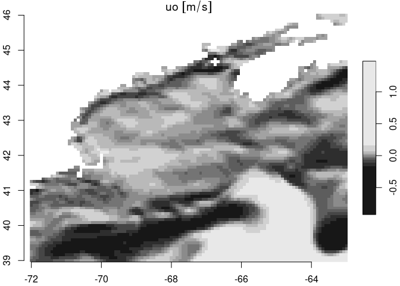

copernicus
================

Provides access, download and archiving tools for
[Copernicus](https://marine.copernicus.eu/) marine datasets using R
language. This package has been developed primarily around …

- [GLOBAL_MULTIYEAR_PHY_001_030](https://data.marine.copernicus.eu/product/GLOBAL_MULTIYEAR_PHY_001_030/description)
  31 Dec 1992 to a month or more lag

- [GLOBAL_ANALYSISFORECAST_PHY_001_024](https://data.marine.copernicus.eu/product/GLOBAL_ANALYSISFORECAST_PHY_001_024/description)
  31 Oct 2020 to 9 days from present (forecast)

With no or minimal modification it can work with other products.

### Note

In 2023/2024 Copernicus migrated to a new service model; learn more
[here](https://help.marine.copernicus.eu/en/articles/7045314-migrating-to-the-new-global-physical-analysis-and-forecasting-system).
This migration introduced the [Copernicus Marine
Toolbox](https://help.marine.copernicus.eu/en/collections/4060068-copernicus-marine-toolbox)
which provides a Python API and a command line interface (CLI). This
package leverages the latter.

The toolbox is under active development, so if you are having troubles
(like we have sometimes!) try re-installing. We have some notes
[here](https://github.com/BigelowLab/copernicus/wiki/Installation-of-%60copernicusmarine%60).

# Copernicus resources

Copernicus serves **so many** data resources; finding what you want can
be a challenge. Check out the new [Marine Data
Store](https://marine.copernicus.eu/news/introducing-new-copernicus-marine-data-store).
And checkout the listing
[here](https://marine.copernicus.eu/about/producers).

## Data catalogs

Like data offerings from [OBPG](https://oceancolor.gsfc.nasa.gov/),
Copernicus strives to provided consistent dataset identifiers that are
easily decoded programmatically (and with practice by eye). In order to
download programmatically you must have the datasetID in hand. Learn
more about Copernicus [nomenclature rules
here](https://help.marine.copernicus.eu/en/articles/6820094-how-is-defined-the-nomenclature-of-copernicus-marine-data#h_34a5a6f21d).
We leverage the [data catalogs](#data-catalogs) which link a **product**
to one or more of its **datasets**. Did you catch that? Copernicus
distributes **products** each of which comes as one or more
**datasets**. There’s mor eon that later.

## `get` or `subset`

The [Copernicus Marine
Toolbox](https://help.marine.copernicus.eu/en/collections/4060068-copernicus-marine-toolbox)
command-line application, `copernicus-marine` provides two primary
methods for donwloading data: `get` and `subset`. `get` is not well
documented, but subset does what it implies - subsetting resources by
variable, spatial bounding box, depth and time. This package only
supports `subset`.

## Requirements

- [R v4.1+](https://www.r-project.org/)
- [rlang](https://CRAN.R-project.org/package=rlang)
- [dplyr](https://CRAN.R-project.org/package=dplyr)
- [ncdf4](https://CRAN.R-project.org/package=ncdf4)
- [sf](https://CRAN.R-project.org/package=sf)
- [stars](https://CRAN.R-project.org/package=stars)
- [readr](https://CRAN.R-project.org/package=readr)
- [twinkle](https://github.com/BigelowLab/twinkle) (not on CRAN)

## Installation

    remotes::install_github("BigelowLab/twinkle")
    remotes::install_github("BigelowLab/copernicus")

## Configuration

You can preconfigure a credentials file (required) and a path definition
file (optional) to streamline accessing and storing data.

### Configure credentials

You must have credentials to access Copernicus holdings - if you don’t
have them now please request access
[here](https://data.marine.copernicus.eu/register). Go straight to it
[here](https://help.marine.copernicus.eu/en/articles/8185007-copernicus-marine-toolbox-credentials-configuration).

### Configure data path

If you plan to use our directory-driven database storage system then you
should set the root path for the data directory; keep in mind that you
can always change or override it. We don’t actually run this in the
README, but you can copy-and-paste to use in R. Again, replace the path
with one suiting your own situation.

    copernicus::set_root_path("/the/path/to/copernicus/data")

Once it is set, you shouldn’t have to set it again (unless you want to
change the path).

#### Configure the application path

If you are using R within a RStudio session, you may encounter issues
where `system()` and `system2()` can’t’ find the `copernicusmarine`
application. This is not the case when you run R outside of the RStudio
context. Technically, this is a environmental path issue, which you can
remedy by providing the full path specification for the `app` argument
to the function `build_cli_subset()`. By default,
`app = 'copernicusmarine`, but you may need to include the full path
specification. We provide a mechanism for storing this path in a
configuration file once, and then it will work without issue in
subsequent sessions of R. Here’s how we set ours.

First determine the app path in the terminal session (outside of RStudio
context).

    $ which copernicusmarine
    /opt/copernicus/bin/copernicusmarine

Then set the path.

``` r
copernicus::set_copernicus_app("/opt/copernicus/bin/copernicusmarine")
```

This is optional (but worth it if you operate within RStudio). You can
retrieve the application path with `get_copernicus_app()`, which
defaults to `copernicusmarine` if you didn’t set the path.

``` r
copernicus::get_copernicus_app()
```

    ## [1] "/opt/copernicus/bin/copernicusmarine"

## Product catalog

You can download a product catalog for local storage.

    ok = copernicus::fetch_product_catalog()

This downloads into a “catalogs” directory within your data directory
Now read it in.

``` r
x = copernicus::read_product_catalog()
x
```

    ## # A tibble: 1,176 × 5
    ##    product_id                             title dataset_id dataset_name vars    
    ##    <chr>                                  <chr> <chr>      <chr>        <list>  
    ##  1 ANTARCTIC_OMI_SI_extent                Anta… antarctic… Sea Ice Ext… <tibble>
    ##  2 ANTARCTIC_OMI_SI_extent_obs            Anta… antarctic… Southern He… <tibble>
    ##  3 ARCTIC_ANALYSISFORECAST_BGC_002_004    Arct… cmems_mod… Arctic Ocea… <tibble>
    ##  4 ARCTIC_ANALYSISFORECAST_BGC_002_004    Arct… cmems_mod… Arctic Ocea… <tibble>
    ##  5 ARCTIC_ANALYSISFORECAST_PHY_002_001    Arct… cmems_mod… Arctic Ocea… <tibble>
    ##  6 ARCTIC_ANALYSISFORECAST_PHY_002_001    Arct… cmems_mod… Arctic Ocea… <tibble>
    ##  7 ARCTIC_ANALYSISFORECAST_PHY_002_001    Arct… cmems_mod… Arctic Ocea… <tibble>
    ##  8 ARCTIC_ANALYSISFORECAST_PHY_002_001    Arct… cmems_mod… Arctic Ocea… <tibble>
    ##  9 ARCTIC_ANALYSISFORECAST_PHY_ICE_002_0… Arct… cmems_mod… neXtSIM-F s… <tibble>
    ## 10 ARCTIC_ANALYSISFORECAST_PHY_ICE_002_0… Arct… cmems_mod… cmems_mod_a… <NULL>  
    ## # ℹ 1,166 more rows

This provides a nested table of available datasets along with tables of
variables for each (if any). For example, the first row has the
following variables table.

``` r
dplyr::slice(x, 1) |>
  dplyr::pull(dplyr::all_of(vars))
```

    ## [[1]]
    ## # A tibble: 5 × 3
    ##   short_name     standard_name  units
    ##   <chr>          <chr>          <chr>
    ## 1 siextents_cglo sea_ice_extent km2  
    ## 2 siextents_glor sea_ice_extent km2  
    ## 3 siextents_mean sea_ice_extent km2  
    ## 4 siextents_oras sea_ice_extent km2  
    ## 5 siextents_std  sea_ice_extent km2

## Which products? Which datasets?

[CMEMS](https://data.marine.copernicus.eu/products) offers many
products - which ones have we set up for this package? (Note, it’s
subject to change).

[GLOBAL_MULTIYEAR_PHY_001_030](https://data.marine.copernicus.eu/product/GLOBAL_MULTIYEAR_PHY_001_030/description)
31 Dec 1992 to a month or more lag

[GLOBAL_ANALYSISFORECAST_PHY_001_024](https://data.marine.copernicus.eu/product/GLOBAL_ANALYSISFORECAST_PHY_001_024/description)
31 Oct 2020 to 9 days from present (forecast)

## Fetching data

To fetch data we’ll focus on [ocean physics daily
forecast](https://data.marine.copernicus.eu/product/GLOBAL_ANALYSISFORECAST_PHY_001_024/download?dataset=cmems_mod_glo_phy-cur_anfc_0.083deg_P1D-m)
which serves daily mean sea surface currents. We’ll define a date range
and the bounding box that covers the Gulf of Maine (gom), and we’ll
confine the request to just the surface data.

``` r
suppressPackageStartupMessages({
  library(stars)
  library(copernicus)
  library(dplyr)
})
product_id = "GLOBAL_ANALYSISFORECAST_PHY_001_024"
dataset_id = "cmems_mod_glo_phy-cur_anfc_0.083deg_P1D-m"    
vars = c("uo","vo")
bb = c(xmin = -72, xmax = -63, ymin = 39, ymax = 46)
path = copernicus_path(product_id, "gom") |>
  make_path()
depth = c(0,1) # just the top 1 meter
time = c(0, 9) + Sys.Date()  # today - and a little ahead window
ofile = copernicus_path("tmp", 
                        paste0(product_id, "__", dataset_id, ".nc"))
ok = download_copernicus_cli_subset(dataset_id = dataset_id, 
                                   vars = vars, 
                                   depth = depth,
                                   bb = bb, 
                                   time = time, 
                                   ofile = ofile)
x = stars::read_stars(ofile)
```

    ## uo, vo,

``` r
x
```

    ## stars object with 4 dimensions and 2 attributes
    ## attribute(s):
    ##                Min.     1st Qu.        Median        Mean    3rd Qu.     Max.
    ## uo [m/s] -1.2678599 -0.06923880 -0.0005947499 0.001666143 0.06905091 1.270773
    ## vo [m/s] -0.4879295 -0.05941393 -0.0092028086 0.016247062 0.04970369 1.277342
    ##           NA's
    ## uo [m/s] 26800
    ## vo [m/s] 26800
    ## dimension(s):
    ##       from  to         offset    delta  refsys x/y
    ## x        1 109         -72.04  0.08333      NA [x]
    ## y        1  85          46.04 -0.08333      NA [y]
    ## depth    1   1      0.494 [m]       NA      NA    
    ## time     1  10 2025-03-28 UTC   1 days POSIXct

We can plot a subset of these using base graphics and the `[` function.
`stars` objects are indexed first by the attribute (variable) followed
by the dimensions. In this case the index order is \[`attribute`, `x`,
`y`, `depth`, `time`\] or \[`attribute`, `x`, `y`, `time`\] for
single-depth objects.

``` r
plot(dplyr::slice(x, "depth", 1) )
```

<!-- -->

## Archiving data

You can download and archive data using the database functionality
provided in this package. There are a number of ways to manage suites of
data, this is just one fairly light weight method.

Here, we store data in a directory tree that starts with `product` and
`region` at it’s root. Within the `region` we divide by `year`,
`monthday`. Within in each `monthday` directory there are one or more
files uniquely named to provide complete identification of datasetid,
time, depth, period, variable and treatment. Each file contains one
raster for one variable at one depth and one time.

Here is an example of a file name that follows this pattern
`datasetid__date_time_depth_period_variable_treatment.tif`.

    GLOBAL_ANALYSISFORECAST_PHY_001_024/nwa/2022/0601/cmems_mod_glo_phy-cur_anfc_0.083deg_P1D-m__2022-06-01T000000_sur_day_uo_raw.tif

Here you can see that data set id and the rest of the identifiers are
separated by a double underscore to aid in programmatic parsing. Time
includes the hour in case we ever want to download the 6-hour data sets.
Depth is currenly only expressed as “sur”, “bot” and “mld”, but use of
measured values such as “1.493” *etc.* is allowed but not currently
used. The treatment, `raw`, in this case means the values are as
downloaded, however, if you ever wanted to roll your own running mean
(say 8-day rolling mean) or some other statistic this naming system
provides the flexibility you will need.

**NOTE** Don’t forget to [set your root data
path](#Configure-data-path).

First we define an output path for the Gulf of Maine data. The path
isn’t created until data is written to it. Then we simply call fetch and
write individual GeoTIFF files into a database structure. Note that we
provide an identifier that provides the provenance of the data. We
receive, in turn, a table that serves as a database.

``` r
x = stars::read_stars(ofile) |>
  dplyr::slice("depth", 1)
```

    ## uo, vo,

``` r
dates = stars::st_get_dimension_values(x, "time")
db = lapply(names(x),
  function(nm){
    db = sprintf("%s__%s_%s_%s_%s_%s%s",
                 dataset_id,
                 format(dates, "%Y-%m-%dT000000"),
                 "sur", 
                 "day",
                 nm,
                 "raw",
                 ".tif") |>
      decompose_filename()
    for(i in seq_along(dates)) write_copernicus(dplyr::slice(x[nm], "time", i), 
                                                dplyr::slice(db, i),
                                                path)
    db
  }) |>
  dplyr::bind_rows()
```

Since this is the first time you have downloaded and archived data, be
sure to save the database.

``` r
write_database(db, path)
```

### Using the database

The database is very light and easy to filter for just the records you
might need. Note that depth is a character data type; this provides you
with flexibility to define depth as ‘surface’ or ‘50-75’ or something
like that.

Let’s walk through reading the database, filtering it for a subset,
reading the files and finally displaying.

``` r
db <- copernicus::read_database(path) |>
  dplyr::glimpse()
```

    ## Rows: 20
    ## Columns: 7
    ## $ id        <chr> "cmems_mod_glo_phy-cur_anfc_0.083deg_P1D-m", "cmems_mod_glo_…
    ## $ date      <date> 2025-03-28, 2025-03-29, 2025-03-30, 2025-03-31, 2025-04-01,…
    ## $ time      <chr> "000000", "000000", "000000", "000000", "000000", "000000", …
    ## $ depth     <chr> "sur", "sur", "sur", "sur", "sur", "sur", "sur", "sur", "sur…
    ## $ period    <chr> "day", "day", "day", "day", "day", "day", "day", "day", "day…
    ## $ variable  <chr> "uo", "uo", "uo", "uo", "uo", "uo", "uo", "uo", "uo", "uo", …
    ## $ treatment <chr> "raw", "raw", "raw", "raw", "raw", "raw", "raw", "raw", "raw…

Now we can read in the files.

``` r
s = read_copernicus(db, path)
s
```

    ## stars object with 3 dimensions and 2 attributes
    ## attribute(s):
    ##           Min.     1st Qu.        Median        Mean    3rd Qu.     Max.  NA's
    ## uo  -1.2678599 -0.06923880 -0.0005947499 0.001666143 0.06905091 1.270773 26800
    ## vo  -0.4879295 -0.05941393 -0.0092028086 0.016247062 0.04970369 1.277342 26800
    ## dimension(s):
    ##      from  to         offset    delta  refsys x/y
    ## x       1 109         -72.04  0.08333      NA [x]
    ## y       1  85          46.04 -0.08333      NA [y]
    ## time    1  10 2025-03-28 UTC   1 days POSIXct

The database diretcory structure looks like this (requires [fs
package](https://CRAN.R-project.org/package=fs)) which you won’t need
just to use copernicus).

``` r
fs::dir_tree(path)
```

    ## /mnt/s1/projects/ecocast/coredata/copernicus/GLOBAL_ANALYSISFORECAST_PHY_001_024/gom
    ## ├── 2025
    ## │   ├── 0328
    ## │   │   ├── cmems_mod_glo_phy-cur_anfc_0.083deg_P1D-m__2025-03-28T000000_sur_day_uo_raw.tif
    ## │   │   └── cmems_mod_glo_phy-cur_anfc_0.083deg_P1D-m__2025-03-28T000000_sur_day_vo_raw.tif
    ## │   ├── 0329
    ## │   │   ├── cmems_mod_glo_phy-cur_anfc_0.083deg_P1D-m__2025-03-29T000000_sur_day_uo_raw.tif
    ## │   │   └── cmems_mod_glo_phy-cur_anfc_0.083deg_P1D-m__2025-03-29T000000_sur_day_vo_raw.tif
    ## │   ├── 0330
    ## │   │   ├── cmems_mod_glo_phy-cur_anfc_0.083deg_P1D-m__2025-03-30T000000_sur_day_uo_raw.tif
    ## │   │   └── cmems_mod_glo_phy-cur_anfc_0.083deg_P1D-m__2025-03-30T000000_sur_day_vo_raw.tif
    ## │   ├── 0331
    ## │   │   ├── cmems_mod_glo_phy-cur_anfc_0.083deg_P1D-m__2025-03-31T000000_sur_day_uo_raw.tif
    ## │   │   └── cmems_mod_glo_phy-cur_anfc_0.083deg_P1D-m__2025-03-31T000000_sur_day_vo_raw.tif
    ## │   ├── 0401
    ## │   │   ├── cmems_mod_glo_phy-cur_anfc_0.083deg_P1D-m__2025-04-01T000000_sur_day_uo_raw.tif
    ## │   │   └── cmems_mod_glo_phy-cur_anfc_0.083deg_P1D-m__2025-04-01T000000_sur_day_vo_raw.tif
    ## │   ├── 0402
    ## │   │   ├── cmems_mod_glo_phy-cur_anfc_0.083deg_P1D-m__2025-04-02T000000_sur_day_uo_raw.tif
    ## │   │   └── cmems_mod_glo_phy-cur_anfc_0.083deg_P1D-m__2025-04-02T000000_sur_day_vo_raw.tif
    ## │   ├── 0403
    ## │   │   ├── cmems_mod_glo_phy-cur_anfc_0.083deg_P1D-m__2025-04-03T000000_sur_day_uo_raw.tif
    ## │   │   └── cmems_mod_glo_phy-cur_anfc_0.083deg_P1D-m__2025-04-03T000000_sur_day_vo_raw.tif
    ## │   ├── 0404
    ## │   │   ├── cmems_mod_glo_phy-cur_anfc_0.083deg_P1D-m__2025-04-04T000000_sur_day_uo_raw.tif
    ## │   │   └── cmems_mod_glo_phy-cur_anfc_0.083deg_P1D-m__2025-04-04T000000_sur_day_vo_raw.tif
    ## │   ├── 0405
    ## │   │   ├── cmems_mod_glo_phy-cur_anfc_0.083deg_P1D-m__2025-04-05T000000_sur_day_uo_raw.tif
    ## │   │   └── cmems_mod_glo_phy-cur_anfc_0.083deg_P1D-m__2025-04-05T000000_sur_day_vo_raw.tif
    ## │   └── 0406
    ## │       ├── cmems_mod_glo_phy-cur_anfc_0.083deg_P1D-m__2025-04-06T000000_sur_day_uo_raw.tif
    ## │       └── cmems_mod_glo_phy-cur_anfc_0.083deg_P1D-m__2025-04-06T000000_sur_day_vo_raw.tif
    ## └── database
